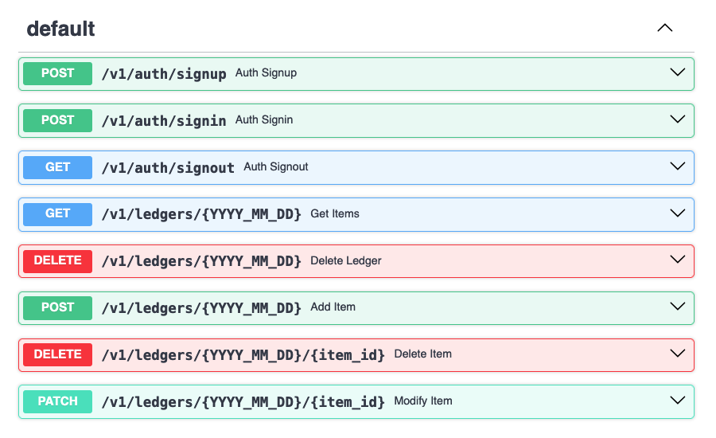

## practice-FastAPI

- Python의 [FastAPI](https://fastapi.tiangolo.com) 프레임워크를 활용해 간단한 API 서버 구현해보기

## About

> Python 3.13.1 used : 파이썬 3.13.1 버전을 사용했습니다
- 가상환경 설정
  - python -m venv .venv
  - source .venv/bin/activate
    - 또는, pyenv와 pyenv-virtualenv를 활용한 가상환경 설정  
    `pyenv virtualenv 3.13.1 fastapi && pyenv local fastapi`
- 필요한 라이브러리 설치
  - pip install "fastapi[standard]" sqlmodel pydantic_settings bcrypt python-jose
    - 또는, `requirements.txt` 파일을 통해 개발환경과 동일한 버전의 라이브러리 설치  
    `pip install -r requirements.txt`
    <!-- requirements.txt를 만드려면, `pip freeze > requirements.txt` ( redirect를 통해 pip freeze 출력을 저장 ) -->

- - -
- v1에서 구현해본 API 목록:

  - 회원가입
    ```shell
    curl -X 'POST' \
      'http://localhost:8000/v1/auth/signup' \
      -H 'accept: application/json' \
      -H 'Content-Type: application/json' \
      -d '{
      "login_id": "qwer",
      "password": "asdf",
      "name": "admin",
      "email": "admin@example.com"
    }'
    ```
  - 로그인
    ```shell
    curl -X 'POST' \
      'http://localhost:8000/v1/auth/signin' \
      -H 'accept: application/json' \
      -H 'Content-Type: application/json' \
      -d '{
      "login_id": "qwer",
      "password": "asdf"
    }'
    ```
  - 로그아웃
    ```shell
    curl -X 'GET' \
      'http://localhost:8000/v1/auth/signout' \
      -H 'accept: application/json'
    ```
  - (1달 단위) 가계부 전체 항목 조회 <- 삭제한 달의 가계부를 조회하면 새로운 가계부 생성
    ```shell
    curl -X 'GET' \
      'http://localhost:8000/v1/ledgers/2025_02_16' \
      -H 'accept: application/json'
      # YYYY, MM 정보만 사용하지만, URL의 일관성을 위해 YYYY_MM_DD 사용
    ```
  - (1달 단위) 가계부 삭제
    ```shell
    curl -X 'DELETE' \
      'http://localhost:8000/v1/ledgers/2025_02_16' \
      -H 'accept: application/json'
      # YYYY, MM 정보만 사용하지만, URL의 일관성을 위해 YYYY_MM_DD 사용
    ```
  - 항목 추가 <- 추가하려는 달의 가계부가 존재하지 않을 경우, 새로운 가계부를 생성한 뒤 항목 추가
    ```shell
    curl -X 'POST' \
      'http://localhost:8000/v1/ledgers/2025_02_16?name=good&price=7777' \
      -H 'accept: application/json' \
      -d ''
    ```
  - 항목 삭제
    ```shell
    curl -X 'DELETE' \
      'http://localhost:8000/v1/ledgers/2025_02_16/33' \
      -H 'accept: application/json'
    ```
  - 항목 수정
    ```shell
    curl -X 'PATCH' \ # PUT보다 PATCH가 더 semantic하다 판단함
      'http://localhost:8000/v1/ledgers/2025_02_16/1?name=bad&price=-4444&mod_day=28' \
      -H 'accept: application/json'
    ```

  

## etc

- BLACK formatter를 활용한 자동 포매팅 ( format on save: Y )
- 직접 구현한 모듈 import 구문은 다른 import 구문과 한 줄 띄워 구분함
- Union Type Hinting 사용 ( `detail: str | None = None` )
  - Python 3.10에 도입된 파이프 연산자(|)를 활용한 타입 힌팅
  - Python<3.10에서는:
    - `from typing import Optional` import 구문 추가 후,  
      `detail: Optional[str] = None` 처럼 사용
